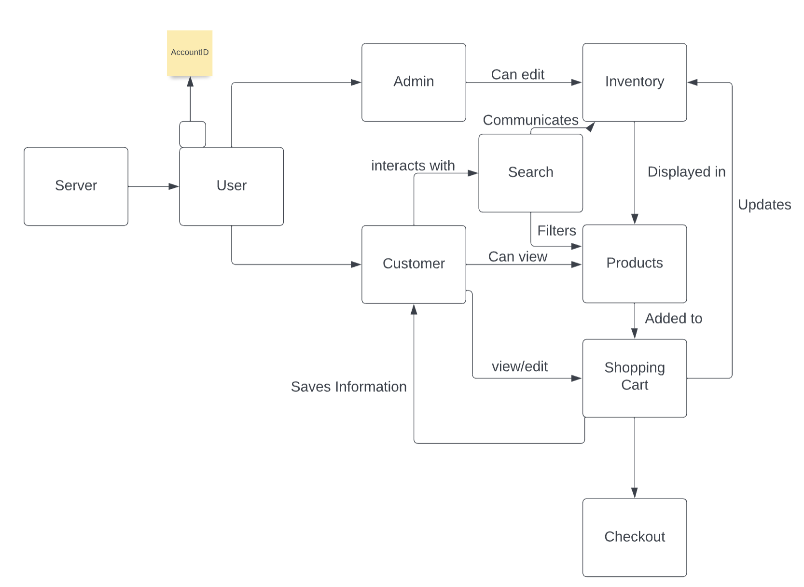

# PROJECT Design Documentation

> _The following template provides the headings for your Design
> Documentation.  As you edit each section make sure you remove these
> commentary 'blockquotes'; the lines that start with a > character
> and appear in the generated PDF in italics._

## Team Information
* Team name: DEAL
* Team members
  * Alex Lee
  * Dylan Greenberg
  * Eli Lurie
  * Lucas French

## Executive Summary

This is a summary of the project.

### Purpose

The project is a e-store that focuses on the distribution of frogs. The most important user group are frog owners and potential frog buyers. The user goals is to make a website where the user can easily access the inventory of frogs sold, search through the inventory, and add their desired items to a shopping cart to be purchased.

### Glossary and Acronyms
N/A

## Requirements

This section describes the features of the application.

> _In this section you do not need to be exhaustive and list every
> story.  Focus on top-level features from the Vision document and
> maybe Epics and critical Stories._

### Definition of MVP
Customers can buy frogs and admins can edit the inventory from which customers purchase.

### MVP Features
Login to account
View products
Search products
Edit products
Shopping cart

### Roadmap of Enhancements
Search for a product based off its attributes
Notify the customer when its time to order more food

## Application Domain

User: A user is a person who interacts with the e-store. 
There are two types of users: 
  Customer: Customer is someone who can view the list of products being sold and add them to their shopping cart to be purchased. 
  Admin: The admin can edit the inventory
Product: A product is any item that the e-store sells. Each product has the following attributes: 
  Name: The name of the product 
  Description: A detailed description of the product 
  Price: The price of the product 
  Quantity: The number of units of the product that are available for purchase
Cart: A cart is a temporary storage area for items that a user intends to purchase. Each cart has the following attributes: 
  User: The user who owns the cart 
  Items: A list of the products in the cart and their quantities
  
## Architecture and Design

Using the SPRING API it communicates with Angular to accept the data inserted by the admin user and allow features for the customer such as the shopping cart.

### Summary

The following Tiers/Layers model shows a high-level view of the webapp's architecture.

The e-store web application, is built using the Model–View–ViewModel (MVVM) architecture pattern. 

The Model stores the application data objects including any functionality to provide persistance. 

The View is the client-side SPA built with Angular utilizing HTML, CSS and TypeScript. The ViewModel provides RESTful APIs to the client (View) as well as any logic required to manipulate the data objects from the Model.

Both the ViewModel and Model are built using Java and Spring Framework. Details of the components within these tiers are supplied below.

### Overview of User Interface

This section describes the web interface flow; this is how the user views and interacts
with the e-store application.

The application starts at a sign in window, this gives the choice for the user to sign in as an admin or make their account as a customer. If a customer signs in there a tabs available to logout, view the products, and to view their shopping cart. If an admin signs in, it shows a list that can be editted by either removing or adding items along with changing the item descriptions.

### View Tier
The home page provides an overview of the e-store, displaying navigation links to different parts of the store. It also includes a search bar, allowing customers to quickly find the products they are looking for. The product pages provide detailed information about each product, including product images, descriptions, pricing, and quantity. Customers can also use product pages to add products to their cart. The shopping cart allows customers to view the items they have added to their cart, modify quantities or remove items, and proceed to checkout when ready.

### ViewModel Tier
The ViewModel Tier is responsible for handling user interactions and updating the view based off the user interactions. The ViewModel contains properties for the list of products and cart items, as well as methods for retrieving product data and updating the shopping cart.

### Model Tier
In the Model Tier of our application, its function is to retrieve and manipulate data. This is used so that information for users can be saved and accessed again. When admins add, remove, or update a product the Model Tier mainpulates the data based off what the admin requested.

### Static Code Analysis/Design Improvements
> _Discuss design improvements that you would make if the project were
> to continue. These improvement should be based on your direct
> analysis of where there are problems in the code base which could be
> addressed with design changes, and describe those suggested design
> improvements._

> _With the results from the Static Code Analysis exercise, 
> discuss the resulting issues/metrics measurements along with your analysis
> and recommendations for further improvements. Where relevant, include 
> screenshots from the tool and/or corresponding source code that was flagged._

## Testing

### Acceptance Testing
> _Report on the number of user stories that have passed all their
> acceptance criteria tests, the number that have some acceptance
> criteria tests failing, and the number of user stories that
> have not had any testing yet. Highlight the issues found during
> acceptance testing and if there are any concerns._

### Unit Testing and Code Coverage
> _Discuss your unit testing strategy. Report on the code coverage
> achieved from unit testing of the code base. Discuss the team's
> coverage targets, why you selected those values, and how well your
> code coverage met your targets. If there are any anomalies, discuss
> those._
